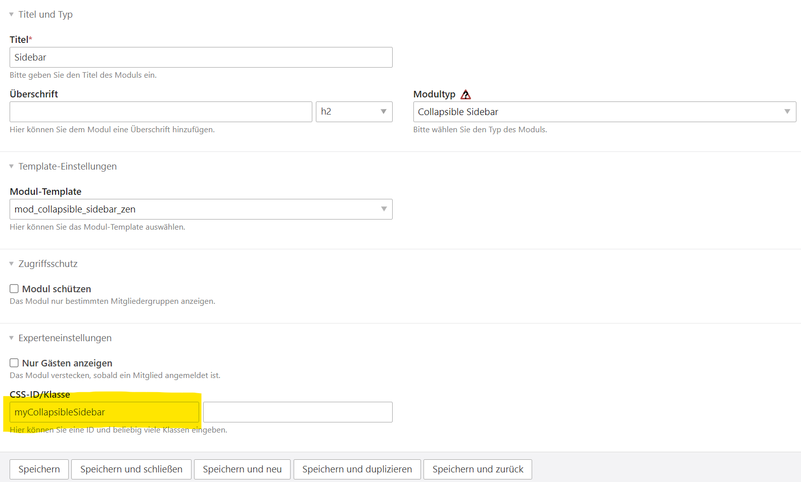

# Contao Collapsible Sidebar
This extension for Contao CMS provides a collapsible sidebar.


## Installation
Via Contao Manager or composer `require markocupic/contao-collapsible-sidebar`.


## Configuration


### 1. Create the frontend module
Create a new frontend module of type **"Collapsible Sidebar"**. Do not forget to add a **CSS-ID** in the experts settings.





### 2. Add the module to the layout
Add the newly created module to your layout.


### 3. Customize the `mod_collapsible_sidebar.html.twig` template
Use the {{insert_module}} or {{insert_article}} insert tags to add more content.
Save then customized template to the `templates/` folder.


### 4. Add a toggle button to the layout
Add the "toggle sidebar" button to your layout using **TWIG include** or the provided **Contao Insert Tag**:

#### a) TWIG include
```
set css_id = 'myCollapsibleSidebar'

```

`{{collapsible_sidebar_toggle::##module_css_id##::##template_name##}}`.
Enter the **CSS-ID** of the related **Collapsible Sidebar frontend module** as the first parameter => `{{collapsible_sidebar_toggle::myCollapsibleSidebar}}`.
The second parameter ##template_name## is optional. You can use it to create your own version of the toggle button template. See 4c!

#### b) Contao Insert Tag
```
{{collapsible_sidebar_toggle::myCollapsibleSidebar}}
```

#### c) Create a custom toggle button
Copy [collapsible_sidebar_toggle.html.twig](https://github.com/markocupic/contao-collapsible-sidebar/blob/main/contao/templates/collapsible_sidebar_toggle.html.twig), modify the content and 
save the file to the templates directory `templates/my_custom_collapsible_sidebar_toggle.html.twig`.

**TWIG**:
```
set css_id = 'myCollapsibleSidebar'

```

**Contao Insert Tag**:
```
{{collapsible_sidebar_toggle::myCollapsibleSidebar::my_custom_collapsible_sidebar_toggle}}
```

### 5. Use your own CSS to style the application
The extension is shipped with a very minimalistic stylesheet. To override the default CSS simply remove `` in the head of your customized module template `/templates/mod_collapsible_sidebar.html.twig` and embed your own stylesheet.


### 6. Finally done!
Use `composer install` or the Contao Manager to rebuild the cache.
